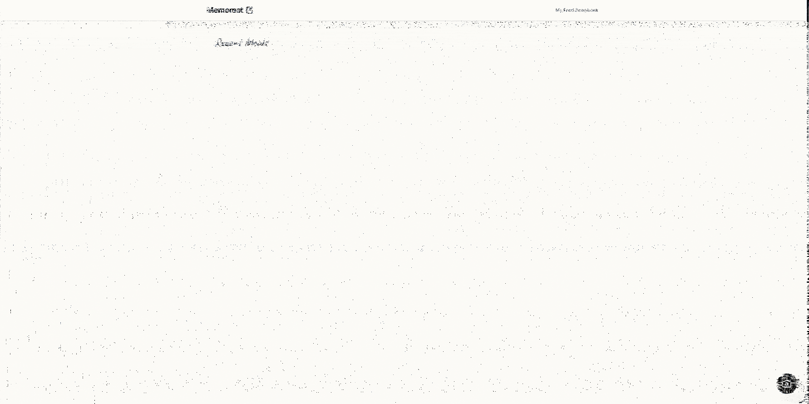
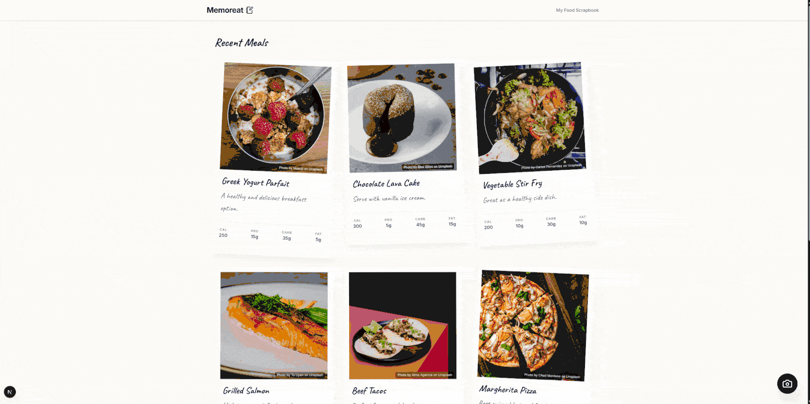

# Memoreat

[ [日本語ドキュメント](README.ja.md) ]

Memoreat is a containerized food-logging application designed to track meals, calories, and nutritional information as easy as how you write in a diary. It is packaged with its PostgreSQL database using Docker, demonstrating modern full-stack application containerization.

## Live Demo

[View Live on Railway](https://memoreat-production.up.railway.app/)

### Desktop View
<p align="center">
  
  
</p>

### Mobile View
<p align="center">
  
  
</p>

## Build Rationale

Memoreat was built not only as a functional calorie and meal tracker, but as a technical showcase to demonstrate:
- **Unified Containerization**: Bundling both the Next.js application and the PostgreSQL database within a unified Docker setup.
- **Optimized Builds**: Utilizing a multi-stage Dockerfile to minimize production image size and improve build performance.
- **Automated CI/CD**: Leveraging GitHub Actions workflows to automatically build and publish Docker images to a container registry upon merging to the main branch.

## Features

- **Meal Logging**: Record food name, calories, macros, and personal reflections.
- **Dashboard**: Visual summary of your nutritional intake.
- **History**: View past meal logs and memories.

## Technology Stack

- **Frontend/Backend**: Next.js (App Router, Server Actions)
- **Language**: TypeScript
- **Styling**: Tailwind CSS
- **Database**: PostgreSQL with Prisma ORM
- **Containerization**: Docker (multi-stage build), Docker Compose

## Prerequisites

- [Docker](https://docs.docker.com/get-docker/) installed.
- [Docker Compose](https://docs.docker.com/compose/install/) installed.

## Getting Started

### 1. Clone the repository
```bash
git clone <your-repo-url>
cd memoreat
```

### 2. Environment Variables
Create a `.env` file in the root directory and add the necessary variables:
```env
POSTGRES_USER=myuser
POSTGRES_PASSWORD=mypassword
POSTGRES_DB=memoreatdb
DATABASE_URL="postgresql://myuser:mypassword@db:5432/memoreatdb?schema=public"
```

### 3. Local Development
To run the app in development mode with hot-reloading:
```bash
docker-compose up
```
The application will be accessible at [http://localhost:3000](http://localhost:3000).

### 4. Production Deployment
To build and run the optimized production container:
```bash
docker-compose -f docker-compose.prod.yml up --build -d
```
This utilizes a multi-stage Dockerfile to minimize image size and starts the services in the background.

## Database Management
Data is persisted in a Docker volume (`postgres-data`). If you need to reset the database:
```bash
docker-compose down -v
```

## CI/CD
This project uses GitHub Actions to automatically build and push the Docker image to a registry upon merging into the main branch.
